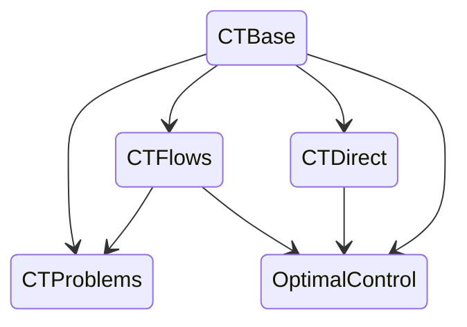

Présentation du projet `ct: control-toolbox`, par Jean-Baptiste Caillau et Olivier Cots

Plan :

- Présentation générale du projet
  - [BOCOP (v2)](https://www.bocop.org)
  - [HamPath](http://www.hampath.org)
  - [nutopy](https://ct.gitlabpages.inria.fr/nutopy)
  - [Bocop3](https://github.com/control-toolbox/bocop)
  - [ct-gallery](https://ct.gitlabpages.inria.fr/gallery/notebooks.html)
  - [control-toolbox.org](https://control-toolbox.org)
- Use case 1a: [basic (functional)](basic_functional.jl)
- Use case 1b: [basic (abstract)](basic_abstract.jl)
- Use case 2a: [Goddard (direct solve)](goddard_direct.jl)
- Use case 2b: [Goddard (indirect solve)](goddard_indirect.jl)
- `ct-repl`: définition interactive d'un problème de contrôle optimal (`julia`)
- [CTProblems.jl](https://control-toolbox.org/CTProblems.jl) : vers un benchmark en contrôle optimal
- Organisation `control-toolbox` (GitHub)

