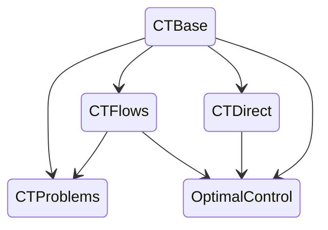

Présentation du projet `ct: control-toolbox`, par Jean-Baptiste Caillau et Olivier Cots

Plan :

- présentation générale du projet `ct`
  - [site officiel](https://control-toolbox.org)
  - [organisation Github](https://github.com/control-toolbox)
  - [ct-gallery](https://ct.gitlabpages.inria.fr/gallery/)
  - [bocop](https://github.com/control-toolbox/bocop)
  - [nutopy](https://ct.gitlabpages.inria.fr/nutopy/)
- exemple [basic version abstraite](basic_abstract.jl)
- exemple [basic version fonctionnelle](basic_functional.jl)
- exemple [Goddard méthode directe](goddard_direct.jl)
- exemple [Goddard méthode indirecte](goddard_indirect.jl)
- présentation de `ct-repl`, un moyen intéractif pour définir son problème de contrôle optimal
- liste de problèmes de contrôle optimal : [documentation](https://control-toolbox.org/CTProblems.jl/)
- architecture de l'organisation `control-toolbox` sous Github :

